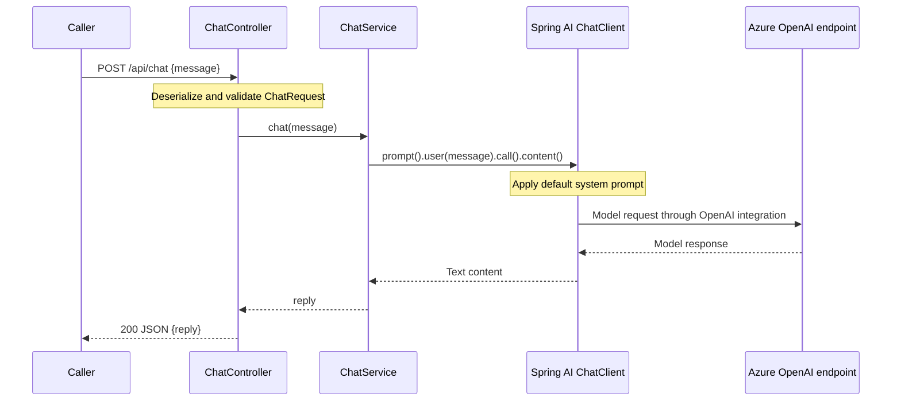

# Spring AI Architecture

This document describes the current `springAI` application in [Siva190130/SpringAI](https://github.com/Siva190130/SpringAI), based on source revision `c27e15bcca7003adf5bef3a0c8b078e662ad7483`, reviewed on 2026-09-15. It documents the application built with Spring AI, rather than the internals of the Spring AI framework. Runtime behavior and provider connectivity have not been verified for this documentation task.

## Overview

The application is a single Spring Boot service exposing a JSON chat endpoint. Spring MVC accepts a message, a service invokes Spring AI's `ChatClient` synchronously, and the controller returns the generated text. The OpenAI model starter and environment-based configuration target an Azure Foundry OpenAI endpoint.

There is no application database, vector store, retrieval pipeline, conversation memory, tool calling, or streaming endpoint in the current source. Each request supplies one user message alongside a shared system prompt.

## Components and dependencies

| Component | Responsibility |
| --- | --- |
| `SpringAiApplication` | Starts Spring Boot and component scanning under `com.siva.springAI`. |
| `ChatController` | Handles `POST /api/chat`, triggers request validation, delegates to the service, and wraps its result in `ChatResponse`. |
| `ChatRequest` / `ChatResponse` | Immutable Java records defining the input `message` and output `reply` fields. |
| `ChatService` | Builds the user prompt and calls `chatClient.prompt().user(userMessage).call().content()`. |
| `ChatClientConfig` | Builds a `ChatClient` bean from the auto-configured builder and sets the default system prompt. |
| Spring AI OpenAI starter | Supplies provider integration and auto-configuration used by the client. |
| `GlobalExceptionHandler` | Maps `ResourceAccessException` to 503 and other handled exceptions to 500 with plain-text responses. |
| Spring Boot Actuator | Exposes health, metrics, and info endpoints according to the application properties. |

The controller and service use Lombok-generated constructors to inject their final dependencies. Client configuration is centralized so system prompts and future advisors can be configured at one integration point.

The Maven build declares Java 21, Spring Boot 4.1.0, and the Spring AI 2.0.0 BOM. Dependencies include Web MVC, validation, Actuator, the OpenAI model starter, Lombok, and Boot test starters.

## Request flow



The system prompt is: `You are a helpful, concise enterprise assistant.` The service waits for a complete model response before returning. Provider latency therefore occupies the request execution thread. The source does not enable virtual threads, configure asynchronous processing, or expose streaming responses.

Only text content is returned; token usage, finish reason, and model metadata are not included in the API response. No conversation identifier or prior messages are stored or forwarded by application code.

## HTTP contract

`POST /api/chat` accepts `Content-Type: application/json`.

Example request:

```json
{"message":"Explain dependency injection in Spring."}
```

Illustrative successful response:

```json
{"reply":"Dependency injection supplies a component with the dependencies it needs."}
```

Generated reply text varies. `ChatRequest.message` has `@NotBlank`, rejecting null, empty, or whitespace-only messages. There is no explicit maximum message length.

| Outcome | Current implementation |
| --- | --- |
| Successful generation | HTTP 200 with a JSON `ChatResponse`. |
| `ResourceAccessException` reaching the advice | HTTP 503 with a plain-text message referring to Ollama on localhost:11434. This message is stale for the configured provider. |
| Other exceptions handled by the catch-all | HTTP 500 with `Unexpected error: ` followed by the exception message. |
| Invalid request | Validation is enabled, but the catch-all exception handler can intercept validation and JSON-reading exceptions and return 500. There is no explicit 400 handler; verify and correct before promising a 400 contract. |

Error responses do not share the success response's JSON schema. Provider authentication, quota, and other errors have no dedicated application mappings.

## Configuration and deployment boundary

The application runs as one JVM process and makes outbound requests to the configured AI provider. Credentials are supplied through environment variables referenced by `application.properties`; no credential values are documented here.

| Setting in source | Value or source | Purpose |
| --- | --- | --- |
| `spring.application.name` | `springAI` | Application identity. |
| `spring.ai.openai.base-url` | `${AZURE_OPENAI_BASE_URL}` | Intended Azure Foundry OpenAI endpoint base URL. |
| `spring.ai.openai.api-key` | `${AZURE_OPENAI_API_KEY}` | Provider credential. |
| `spring.ai.openai.chat.model` | `${AZURE_OPENAI_DEPLOYMENT}` | Intended deployment/model selection. |
| `spring.ai.openai.chat.max-completion-tokens` | `4096` | Intended output-token limit. |
| `spring.ai.openai.chat.temperature` | `1` | Intended sampling setting. |
| `management.endpoints.web.exposure.include` | `health,metrics,info` | Exposed management endpoint IDs. |

These are the exact property keys present in source, not confirmation that all bind to Spring AI 2.0.0. In particular, verify whether model options require the `spring.ai.openai.chat.options.*` prefix before relying on the deployment, token limit, or temperature values. Also verify how the provider integration composes the configured base URL with its API path. A comment names GPT-5.4, but the actual deployment is environment-specific and cannot be inferred from the repository.

With Java 21 and the required environment configured, the included Maven wrapper provides the normal build and launch entry points:

```powershell
.\mvnw.cmd test
.\mvnw.cmd spring-boot:run
```

The repository contains no Dockerfile or Compose deployment definition. No custom server port is set. Under default Boot configuration the application uses port 8080, with management paths `/actuator/health`, `/actuator/metrics`, and `/actuator/info`.

## Operational characteristics and current gaps

The service contains no application-level persistence and does not maintain chat history. This permits replicas without application conversation-state synchronization, although request capacity remains dependent on provider limits and blocking request execution.

Actuator is included, but no custom provider health indicator, metrics exporter, tracing configuration, or application-level token accounting is defined. A healthy application endpoint alone does not establish that a model request will succeed. No application-specific timeout, retry, circuit breaker, concurrency limit, or rate limit is configured; library defaults may still apply.

No Spring Security dependency or authentication/authorization configuration appears in the repository. Any access controls supplied by deployment infrastructure are outside the inspected source. The generic exception handler returns exception messages directly to callers.

Recommended follow-up work, separate from the implemented architecture:

1. Verify configuration binding and Azure endpoint compatibility with a real deployment.
2. Replace Ollama-specific comments, exception wording, and the stale HELP.md reference with provider-accurate guidance.
3. Add explicit validation and malformed-JSON handlers, consistent error DTOs, and sanitized provider-error responses.
4. Define request size limits, authentication, rate limits, timeout/retry policy, and management-endpoint access for the deployment.
5. Add endpoint and service tests covering success, invalid input, and provider failures; assess streaming or virtual threads against expected concurrency.

## Verification and source map

The existing test suite contains one `@SpringBootTest` context-loading test. It does not establish endpoint behavior, provider connectivity, configuration binding, or failure mapping. No tests or live model requests were run for this documentation-only task.

Source links are pinned to the reviewed revision:

- [Build and dependency versions](https://github.com/Siva190130/SpringAI/blob/c27e15bcca7003adf5bef3a0c8b078e662ad7483/pom.xml)
- [Application entry point](https://github.com/Siva190130/SpringAI/blob/c27e15bcca7003adf5bef3a0c8b078e662ad7483/src/main/java/com/siva/springAI/SpringAiApplication.java)
- [Controller](https://github.com/Siva190130/SpringAI/blob/c27e15bcca7003adf5bef3a0c8b078e662ad7483/src/main/java/com/siva/springAI/controller/ChatController.java)
- [Service](https://github.com/Siva190130/SpringAI/blob/c27e15bcca7003adf5bef3a0c8b078e662ad7483/src/main/java/com/siva/springAI/service/ChatService.java)
- [Client configuration](https://github.com/Siva190130/SpringAI/blob/c27e15bcca7003adf5bef3a0c8b078e662ad7483/src/main/java/com/siva/springAI/config/ChatClientConfig.java)
- [Request DTO](https://github.com/Siva190130/SpringAI/blob/c27e15bcca7003adf5bef3a0c8b078e662ad7483/src/main/java/com/siva/springAI/dto/ChatRequest.java)
- [Response DTO](https://github.com/Siva190130/SpringAI/blob/c27e15bcca7003adf5bef3a0c8b078e662ad7483/src/main/java/com/siva/springAI/dto/ChatResponse.java)
- [Exception handling](https://github.com/Siva190130/SpringAI/blob/c27e15bcca7003adf5bef3a0c8b078e662ad7483/src/main/java/com/siva/springAI/exception/GlobalExceptionHandler.java)
- [Application properties](https://github.com/Siva190130/SpringAI/blob/c27e15bcca7003adf5bef3a0c8b078e662ad7483/src/main/resources/application.properties)
- [Existing test](https://github.com/Siva190130/SpringAI/blob/c27e15bcca7003adf5bef3a0c8b078e662ad7483/src/test/java/com/siva/springAI/SpringAiApplicationTests.java)
