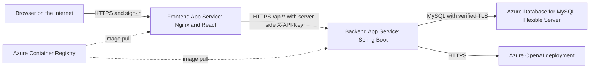

# Review: Docker and Azure App Service deployment

Reviewed on 2026-09-27 against the current working tree, including existing uncommitted changes.

## Goal and recommendation

Your proposed architecture is appropriate: deploy the backend and frontend as **two separate Linux container Web Apps in Azure App Service**. For this learning project, both Web Apps can share one Linux App Service Plan to reduce cost. They remain separate applications with separate images, settings, logs, and deployments, but share the plan's compute capacity and scaling.

Use a frontend container running Nginx to serve the React build and proxy `/api/*` to the backend Web App over HTTPS. Use a backend container running the Spring Boot executable JAR. Store conversations in Azure Database for MySQL Flexible Server and images in Azure Container Registry (ACR).

The result is an internet-accessible frontend URL with sign-in restricted to your account. This is appropriate for learning App Service with the existing personal, shared-history application. Anonymous public use or private histories for multiple users would require additional application security work.

**Current readiness:** the application has useful deployment foundations, but it is not yet ready to deploy as container images. Dockerfiles, a production frontend proxy, and Azure resource configuration are missing. The changes described below are recommendations only; this review does not implement them.

## Repository findings

| Area and evidence | Current behavior | Deployment implication |
| --- | --- | --- |
| `pom.xml`, Maven wrapper | Java 21, Spring Boot 4.1.0, Spring AI 2.0.0; executable JAR packaging | Build with Java 21 and run with a Java 21 runtime. Verify the declared dependencies resolve during the real image build. |
| `frontend/package.json`, `frontend/package-lock.json` | React 19, TypeScript, Vite 7, Tailwind 4; Node >=22.12; committed npm lockfile | Use a compatible pinned Node image, `npm ci`, and `npm run build`; serve `dist/` from a production web server. |
| `frontend/src/lib/chat-api.ts` | Browser calls relative `/api/chat`, `/api/chat/stream`, and `/api/chat/sessions` URLs | The frontend host must forward these routes to Spring. Simply deploying two images will not connect them. |
| `frontend/vite.config.ts`, `frontend/.env.example` | Vite's development proxy reads `BACKEND_URL` and injects `X-API-Key` | This proxy does not exist in `dist/`. App Service environment variables alone cannot recreate it. |
| `src/main/resources/application.properties` | Backend binds to `127.0.0.1` by default | Set `SERVER_ADDRESS=0.0.0.0` inside the backend container or App Service cannot reach it. |
| `application-prod.properties`, `ApiAccessPolicy.java` | `prod` requires a nonblank `CHAT_API_KEY`; health is exposed without application authentication | Supply a shared server-side key and configure `/actuator/health` as the backend health path. |
| `ApiAccessFilter.java` | Only the exact `/actuator/health` path bypasses the key check | Use that exact path for probes. The backend root and other paths are not anonymous health endpoints. |
| `ConversationMemory.java`, Flyway migration | MySQL stores conversations, completed turns, idempotency records, and request leases | MySQL is a required runtime dependency, not optional storage. Use a managed database outside both application containers. |
| `ChatController.java`, `ChatService.java` | NDJSON response streaming, 75-second provider stream deadline, 64,000-character response ceiling | Configure the reverse proxy for incremental delivery and suitable timeouts. WebSockets are not required. |
| Frontend transport | Browser request timeout is 90 seconds | Keep the full request within that budget; larger proxy timeouts do not extend the browser timeout. |
| History controllers and storage | All authorized callers share one history; no user ownership field or account boundary | Restrict access to your learning account. Authentication alone does not create per-user histories. |
| Tests | Backend tests cover access, persistence, controllers, and streaming; frontend tests mock transport | Useful predeployment checks, but they do not prove Azure networking, identity, image startup, or live model connectivity. |
| Deployment files | No Dockerfile, Docker ignore file, Compose configuration, or deployment workflow found | Add these in a future implementation task; CI/CD can follow the first manual deployment. |
| `docs/spring-ai-architecture.md` | Describes an older revision without database/history/streaming | Treat current source and READMEs as the deployment baseline. Refresh that document separately later. |

## Target architecture



App Service Authentication runs in front of the frontend container. After sign-in, the browser loads React and sends same-origin API requests to Nginx. Nginx forwards them to Spring and supplies the application key. Spring uses its own credentials to contact MySQL and the model provider.

The browser does not need the backend hostname or any service credentials. Keeping the existing relative API URLs avoids frontend source changes and cross-origin browser requests. Two separate App Services do not require the browser to use two origins.

Do not point the production proxy at `localhost`, `127.0.0.1`, or a Docker Compose service name. Separate Web Apps are separate network environments, even when they share an App Service Plan. Use the backend's actual Azure default hostname, copied from the portal.

## Required work before deployment

### 1. Backend container

Add a multi-stage root `Dockerfile` in a future implementation:

1. Build with JDK 21 and the Maven wrapper. Copy `pom.xml`, `mvnw`, `.mvn/`, and `src/` into the build stage.
2. Ensure the wrapper has Linux-compatible line endings and execution permissions. Build the executable JAR with `./mvnw -B verify`.
3. Copy only the executable application JAR into a Java 21 runtime stage. The current expected filename is `springAI-0.0.1-SNAPSHOT.jar`; avoid accidentally selecting a non-executable original JAR.
4. Run as a non-root user with an exec-form Java entrypoint so shutdown signals reach the JVM.
5. Listen on `0.0.0.0:8080`, declare container port 8080, and supply runtime settings through App Service.
6. Log to stdout/stderr and keep credentials out of build arguments, image layers, and copied environment files.

No persistent application volume is required for chat history: history lives in MySQL. Size JVM memory with headroom for native memory, threads, and the frontend sharing the plan. Measure actual memory before increasing concurrency or choosing a smaller plan.

### 2. Frontend container and production proxy

Add `frontend/Dockerfile` with a compatible Node build stage and an unprivileged Nginx runtime stage. Use `npm ci` with the existing lockfile, run `npm run build`, and copy only `dist/` into the static document root. Listen on port 8080. Do not run `vite dev` or `vite preview` as the production server.

The production Nginx configuration must:

- Serve React files and provide `index.html` fallback for frontend navigation.
- Handle `/api/` before the static fallback, forwarding all API methods, bodies, and query strings.
- Preserve the entire `/api/...` path. An accidental trailing slash in `proxy_pass` can strip the `/api/` prefix and cause backend 404s.
- Forward to the backend HTTPS origin using the correct upstream `Host`, TLS SNI, and certificate verification with a trusted CA bundle.
- Overwrite the outbound `X-API-Key` using the server-side `CHAT_API_KEY`; do not trust a browser-supplied value.
- Disable proxy response buffering and caching for the API stream, avoid compression buffering, and use a proxy read timeout such as 120 seconds. The existing browser still stops at 90 seconds.
- Avoid automatic retries of model POST requests, which can create extra provider calls.
- Provide a small local `/healthz` endpoint for frontend health checks without contacting the paid model.
- Avoid logging credentials, request bodies, or conversation identifiers in API access logs.

Use a startup template to read `BACKEND_URL` and `CHAT_API_KEY` from the container environment. Nginx does not automatically substitute arbitrary environment variables into its configuration. Substitute only intended placeholders so native Nginx variables remain intact, and keep the generated configuration outside the public document root. Use a strong key encoded with configuration-safe characters, such as hexadecimal, and do not print the rendered configuration to logs.

These are server settings, not `VITE_*` values. Vite variables are compiled into public JavaScript at build time; Azure runtime settings do not rewrite that JavaScript.

### 3. Docker build contexts and local integration

Add a root `.dockerignore` and a `frontend/.dockerignore`. The root backend context should exclude the frontend, `.git`, IDE metadata, local environment files, credentials, caches, and generated outputs. The frontend context should exclude `node_modules`, `dist`, test artifacts, local environment files, and credentials. Preserve the lockfile and files needed by the builds. Git ignore rules do not automatically protect Docker contexts.

Optionally add `compose.yaml` for local integration with frontend, backend, and MySQL services. Use a named database volume, readiness checks, and an uncommitted environment file. Within Compose, configure service DNS names for backend and database connectivity. Publish the frontend only to localhost while testing. Local HTTP proxying and Azure HTTPS proxying need appropriate separate settings.

Compose is a local test convenience; this proposal deploys two independent Azure Web Apps, not a Compose stack inside one Web App.

## Azure resources and configuration

### Resource layout

| Resource | Suggested learning setup |
| --- | --- |
| Resource group | One dedicated group for this exercise, making cost tracking and later cleanup easier. |
| App Service Plan | One Linux plan on a paid tier supporting the chosen container features; start by evaluating Basic B1 capacity and regional availability. |
| Frontend Web App | One Linux custom-container app with HTTPS Only, authentication, and container port 8080. |
| Backend Web App | One Linux custom-container app with HTTPS Only, container port 8080, and the production Spring profile. |
| ACR | Basic registry for the two image repositories, subject to your networking requirements. |
| MySQL Flexible Server | Small supported burstable configuration for learning, with backups and verified TLS. |
| Azure OpenAI | Existing or new resource with a deployed model and sufficient quota in the chosen region. |
| Key Vault | Optional first iteration; recommended later for secret references and rotation. |

Keep resources in the same region where practical. An App Service is the application; its App Service Plan supplies compute. Two apps in one plan share capacity. Separate plans are useful later for independent scaling or stronger workload isolation.

### Ports and container mode

Select Linux custom-container hosting, rather than a built-in Java or Node runtime. Set the image reference and container listening port for each Web App.

- For the legacy custom-container configuration, set `WEBSITES_PORT=8080`.
- For sidecar-enabled App Service configuration, set the main container's target port to 8080 in the container configuration; do not rely on `WEBSITES_PORT` for that mode.
- Set `SERVER_PORT=8080` explicitly on the backend and configure Nginx to listen on 8080.
- `EXPOSE 8080` is image metadata; it neither changes the application's listener nor replaces App Service port configuration.

The public browser address uses HTTPS port 443. App Service terminates incoming TLS and routes traffic to the configured container port. For the initial deployment, use the platform-provided hostname and certificate; a custom domain is unnecessary.

Azure portal labels, supported tiers, and container configuration interfaces can change. Confirm the selected hosting mode and its current port settings during implementation.

### Backend App Service environment settings

| Setting | Value or purpose |
| --- | --- |
| `SPRING_PROFILES_ACTIVE` | `prod` |
| `SERVER_ADDRESS` | `0.0.0.0` |
| `SERVER_PORT` | `8080` |
| `CHAT_API_KEY` | Strong random application key shared only with the trusted frontend proxy. |
| `AZURE_OPENAI_BASE_URL` | Actual Azure OpenAI v1 base URL expected by the installed SDK; confirm endpoint/path composition with a real request. |
| `AZURE_OPENAI_API_KEY` | Model provider secret; backend only. |
| `AZURE_OPENAI_DEPLOYMENT` | Actual deployment name configured in Azure. |
| `DB_URL` | JDBC URL for the hosted database, with verified TLS and UTC connection time zone. |
| `DB_USERNAME` | Dedicated database user. |
| `DB_PASSWORD` | Database secret; backend only. |
| `AI_TIMEOUT` | Existing default `60s`; retain initially. |
| `AI_MAX_RETRIES` | Existing default `0`; retain initially to limit unexpected extra calls. |
| `CHAT_MAX_CONCURRENT_REQUESTS` | Consider `2` for a small personal learning deployment; current default is `16`. |
| `CHAT_REQUESTS_PER_MINUTE` | Consider `10` for learning; current default is `60`. |
| `CHAT_REQUEST_LEASE_SECONDS` | Retain `300`, longer than the stream deadline. |

Keep the existing memory limits initially: 10 turns and 64,000 characters. Rate limiting and concurrency are per backend instance, not subscription-wide spending controls.

Example database URL shape, with placeholders rather than credentials:

```text
jdbc:mysql://<server>.mysql.database.azure.com:3306/spring_ai?sslMode=VERIFY_IDENTITY&connectionTimeZone=UTC
```

Create `spring_ai` before application startup instead of depending on `createDatabaseIfNotExist=true`. Grant the application account the schema DDL permissions needed by Flyway and normal data access permissions. Confirm the JVM trusts the database server's certificate chain; do not disable TLS verification to solve connection errors. More mature deployments can run migrations under a separate identity later.

### Frontend App Service environment settings

| Setting | Purpose |
| --- | --- |
| `BACKEND_URL` | Backend's HTTPS origin, with no appended `/api` path; consumed by the proposed proxy template. |
| `CHAT_API_KEY` | Same application key as the backend; consumed only by the proposed proxy template. |

Do not put MySQL credentials or Azure OpenAI credentials on the frontend service. If Key Vault references are used, grant each Web App's managed identity access only to its required secrets.

### Authentication and network access

For the first internet deployment, enable App Service Authentication on the frontend with Microsoft Entra ID and require authentication. Use a single-tenant registration and restrict the enterprise application's assignments to your account, or use an equivalent explicit identity allowlist. Merely selecting single-tenant sign-in may allow other users in that tenant.

Protect `/api/*` as well as the page: an anonymously accessible key-injecting proxy would expose paid model calls and allow reading, renaming, and deleting the shared history. Configure health-check authentication exclusions narrowly for `/healthz` only if needed, and verify actual App Service health probes succeed.

The backend already authenticates the proxy with `CHAT_API_KEY`. For a simple initial exercise, it can retain a public HTTPS endpoint with this key required for all application requests. Confirm requests without the key fail. This does not make the backend private. Do not enable interactive sign-in on the backend without also designing machine authentication for Nginx, or its requests will fail or redirect.

As a later networking exercise, restrict backend ingress using correctly configured access restrictions or a private endpoint with frontend VNet integration and private DNS. Sharing an App Service Plan does not grant private connectivity. Allowlisting outbound addresses also requires maintenance and is not a substitute for the application key.

For a public-network MySQL learning setup, allow only the backend's relevant outbound IP addresses and any temporary administrative client address. Account for the possible outbound addresses shown by App Service and changes after tier/network changes. Avoid broad access from every Azure service. Private database networking is a later option requiring backend VNet integration and DNS configuration.

## Suggested implementation and deployment order

1. **Prepare images:** add the proposed Dockerfiles, ignore files, and frontend proxy template. Keep all secrets out of source and images.
2. **Run existing checks:** from the repository root run `.\mvnw.cmd verify` with Java 21. From `frontend/`, run `npm ci`, `npm run lint`, `npm run typecheck`, `npm test`, and `npm run build`. These commands are future validation steps, not checks performed by this review.
3. **Test locally:** build Linux images and verify frontend-to-backend routing, MySQL readiness/migrations, production key enforcement, persistence across restarts, and incremental streaming. A local model smoke test needs real credentials and incurs usage.
4. **Create Azure dependencies:** create the resource group, registry, plan, database, and model deployment or select existing resources. Set a budget alert before sustained testing.
5. **Publish images:** push separate `springai-backend:<version>` and `springai-frontend:<version>` images to ACR. Use immutable release tags or image digests so rollback is predictable. ACR remote builds can be used if local Docker is unavailable.
6. **Enable registry access:** assign each Web App a managed identity, grant the appropriate image-pull role, and explicitly configure App Service to pull with that identity. For a standard RBAC registry this is typically `AcrPull`; ABAC-enabled registries use their repository permissions. Registry identity does not automatically configure model or database authentication.
7. **Deploy backend first:** configure its image, listening port, environment, and database networking. Check startup logs for Flyway success and a healthy application. Test a small authenticated model request.
8. **Deploy frontend:** configure its image, proxy environment, health path, and restricted Entra sign-in. Enable authentication before making the key-injecting proxy available to anonymous callers.
9. **Verify through the internet URL:** use the actual frontend HTTPS address in a browser and complete the acceptance checks below.
10. **Practice operations:** inspect logs, restart each app independently, deploy a second image version, and switch back to the previous image. Add automated deployment only after the manual process works.

Configure backend health checks at `/actuator/health` and frontend checks at `/healthz`. Health must not generate paid model calls. Backend health may reflect database availability but cannot substitute for a model smoke test. Enable container logs and Always On where supported by the selected plan, and allow enough startup time for image pulls, JVM startup, and migrations.

## Acceptance checks

- The frontend opens at its Azure HTTPS URL from an external network and requires your authorized sign-in.
- An anonymous request to frontend `/api/chat/sessions` cannot read history or use the injected key.
- Direct backend application requests without a valid `X-API-Key` are rejected; backend health remains reachable as intended.
- Browser network requests stay on the frontend origin. Bundles and browser-visible configuration contain no application, database, or provider keys.
- Sending a message creates a conversation and streams visible partial text before the final `done` event. Test through Azure, since local streaming does not establish gateway behavior.
- History survives a browser refresh and independent frontend/backend restarts. Rename, delete, and pagination work.
- Stopping or interrupting a response does not display a partial reply as successful. Retrying a completed request returns its saved reply without an extra model call.
- Missing database access produces actionable startup/health diagnostics. Invalid provider credentials produce a safe application error, not a secret-bearing response.
- Logs omit credentials and conversation content, and both health probes show the correct container as healthy.
- Switching to the previous image restores the previous application version. Database migrations require a separate compatibility/backup strategy; reverting an image does not revert the schema.

## Common problems to expect

| Symptom | First checks |
| --- | --- |
| Backend startup timeout or gateway error | `SERVER_ADDRESS`, actual listening port, App Service container mode, missing environment settings, database connectivity, and image-pull logs. |
| UI loads but API returns HTML or 404 | Missing Nginx API location, incorrect route ordering, or stripped `/api` prefix. |
| Every API call returns 401 | Proxy key missing/mismatched, template not rendered, or an extra backend authentication layer. |
| Proxy returns 502 | Backend hostname, readiness, DNS, TLS SNI, certificate trust, and access restrictions. |
| Reply appears only at the end | Buffering/compression at Nginx or another gateway; verify the actual NDJSON stream. |
| Stream fails near 90 seconds | Browser timeout plus provider/database/network latency; a larger Nginx timeout alone does not fix it. |
| Database connection or migration failure | Firewall, TLS trust, schema existence, credentials, and Flyway DDL permissions. |
| Image pull denied | Registry role, selected pull identity, image/tag existence, and registry network rules. |
| Unexpected shared chats | Current data model is a single shared workspace; Entra sign-in does not add ownership filtering. |

## Cost and learning scope

Expect separate charges for the App Service Plan, MySQL, registry, model usage, and possibly logging/networking. Two Web Apps sharing one plan use the same plan compute allocation, but database and model charges remain separate. Confirm current regional prices before provisioning; this review does not provide a verified quote.

Budget alerts notify you but do not automatically cap spending. Keep concurrency and provider quotas small for learning. Stopping a Web App does not remove the App Service Plan's compute charges. After the exercise, back up anything needed and delete the dedicated resources when you no longer need them.

Defer Kubernetes, Front Door, API Management, autoscaling, custom domains, and elaborate CI/CD until the two-container deployment works. The first milestone is a protected public URL, successful model response, durable history, observable logs, and a repeatable deployment.

## Review limits and references

This is a static, deployment-focused repository review. No builds, tests, Docker runs, live Azure calls, or resource creation were performed. No code or existing configuration was changed. The only file created for this task is `review.md`.

Use these Microsoft documentation entry points to confirm current platform details during implementation; they were not live-verified for this review:

- [Configure a custom container in App Service](https://learn.microsoft.com/azure/app-service/configure-custom-container)
- [App Service sidecar configuration](https://learn.microsoft.com/azure/app-service/configure-sidecar)
- [App Service Authentication](https://learn.microsoft.com/azure/app-service/overview-authentication-authorization)
- [App Service health checks](https://learn.microsoft.com/azure/app-service/monitor-instances-health-check)
- [App Service Key Vault references](https://learn.microsoft.com/azure/app-service/app-service-key-vault-references)
- [MySQL Flexible Server TLS connectivity](https://learn.microsoft.com/azure/mysql/flexible-server/how-to-connect-tls-ssl)
